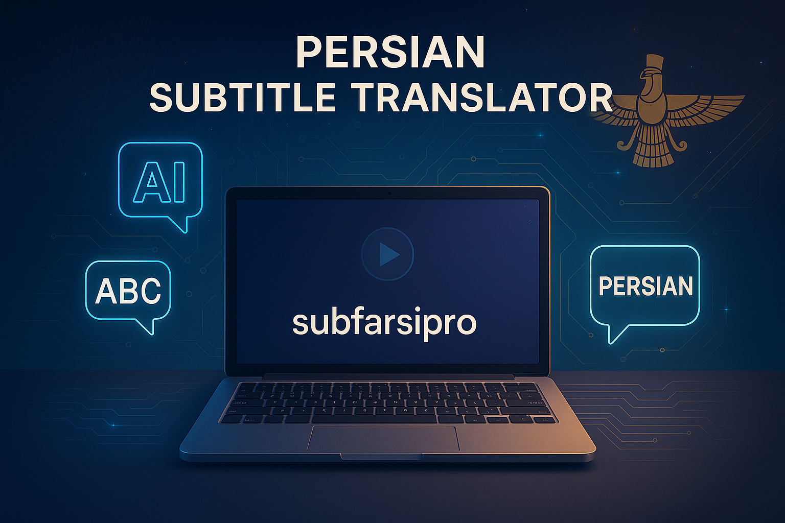

# Persian Subtitle Translator - Professional Edition

A powerful and user-friendly tool to translate video subtitles from English to Persian (Farsi) using Whisper AI and advanced models like Ollama or Gemini.



## 🎯 Features

- 🎥 Extract audio from any video format (MP4, AVI, MKV, etc.)
- 🎤 Generate accurate English subtitles with Whisper AI
- 🌍 Translate to natural Persian with Ollama (local) or Gemini API
- 📄 Export professional SRT subtitle files
- 🔧 Automatic timing adjustment and robust error handling
- 📊 Detailed progress tracking
- 🎮 **NEW**: Advanced CUDA detection and GPU compatibility checks
- 🛡️ **NEW**: Automatic fallback to CPU mode if GPU issues detected
- 🔍 **NEW**: Version mismatch detection for CUDA/PyTorch compatibility

## 📋 Requirements

- FFmpeg installed (`sudo apt install ffmpeg` or `brew install ffmpeg`)
- Python 3.7+ with required packages
- Ollama running locally (recommended) or a Gemini API key
- **CUDA (optional)** - For GPU acceleration (10-50x faster). See [CUDA_INSTALLATION_GUIDE.md](CUDA_INSTALLATION_GUIDE.md) for detailed installation instructions

## 🚀 Installation

1. Clone the repository:
   ```bash
   git clone https://github.com/rootrager/subfarsipro.git
   cd subfarsipro
   ```

2. Install dependencies:
   ```bash
   pip install -r requirements.txt
   ```

   Or install manually:
   ```bash
   pip install git+https://github.com/openai/whisper.git google-generativeai requests torch
   ```

3. (Optional) For GPU acceleration, install PyTorch with CUDA support:
   
   **For CUDA 11.8:**
   ```bash
   pip install torch torchvision torchaudio --index-url https://download.pytorch.org/whl/cu118
   ```
   
   **For CUDA 12.1:**
   ```bash
   pip install torch torchvision torchaudio --index-url https://download.pytorch.org/whl/cu121
   ```
   
   **Note:** CUDA 11.5 users should use cu118 builds (they are compatible).
   
   See [CUDA_INSTALLATION_GUIDE.md](CUDA_INSTALLATION_GUIDE.md) for complete instructions.

## 💻 Usage

### Simple Usage:
```bash
python3 subfarsipro/subfarsipro_v3.py
```

### With Virtual Environment (Recommended):
If you have a virtual environment with PyTorch installed:
```bash
# Activate your virtual environment first
source /path/to/your/venv/bin/activate
python3 subfarsipro/subfarsipro_v3.py
```

### Using the Run Script:
```bash
./run_subfarsipro.sh
```

The script will guide you through:
1. Choosing translation method (Ollama/Gemini)
2. Configuring Whisper model (auto-select based on GPU memory or manual)
3. Selecting video file
4. Processing and generating Persian subtitles

## 🎮 GPU Support

This version includes **advanced CUDA detection and compatibility checking**:

- ✅ Automatic detection of system CUDA version
- ✅ Automatic detection of PyTorch CUDA version
- ✅ Version mismatch detection and warnings
- ✅ Runtime CUDA operation testing before model loading
- ✅ Automatic fallback to CPU mode if GPU issues detected
- ✅ Smart model selection based on GPU memory

The program will automatically:
- Detect your GPU and available VRAM
- Select the appropriate Whisper model size
- Fall back to CPU mode if there are compatibility issues
- Provide detailed diagnostics and solutions for CUDA problems

## 📖 CUDA Installation Guide

For detailed CUDA installation instructions, see [CUDA_INSTALLATION_GUIDE.md](CUDA_INSTALLATION_GUIDE.md).

## 🔧 Troubleshooting

### CUDA Version Mismatch
If you see a CUDA version mismatch warning:
- System CUDA and PyTorch CUDA versions are different
- Install PyTorch compatible with your system CUDA version
- The program will provide specific installation commands

### GPU Not Detected
- Check NVIDIA driver: `nvidia-smi`
- Verify CUDA installation: `nvcc --version`
- The program will automatically use CPU mode if GPU is unavailable

### Translation Errors
- Make sure Ollama is running: `ollama serve`
- Verify your Ollama model is installed: `ollama list`
- Check Gemini API key if using Gemini mode

## 📝 Changelog

### Version 3.0 (Latest)
- ✨ Added advanced CUDA detection and compatibility checking
- ✨ Automatic CUDA version mismatch detection
- ✨ Runtime CUDA operation testing
- ✨ Smart GPU memory-based model selection
- ✨ Automatic fallback to CPU mode with detailed error messages
- ✨ Improved error handling and diagnostics
- ✨ Added support for CUDA 11.5 compatibility
- 📝 Updated documentation with CUDA troubleshooting guide

## 🤝 Contributing

Contributions are welcome! Please feel free to submit a Pull Request.

## 📄 License

This project is open source and available for use.

## 🔗 Links

- [GitHub Repository](https://github.com/rootrager/subfarsipro)
- [CUDA Installation Guide](CUDA_INSTALLATION_GUIDE.md)

---

Made with ❤️ for the Persian-speaking community
